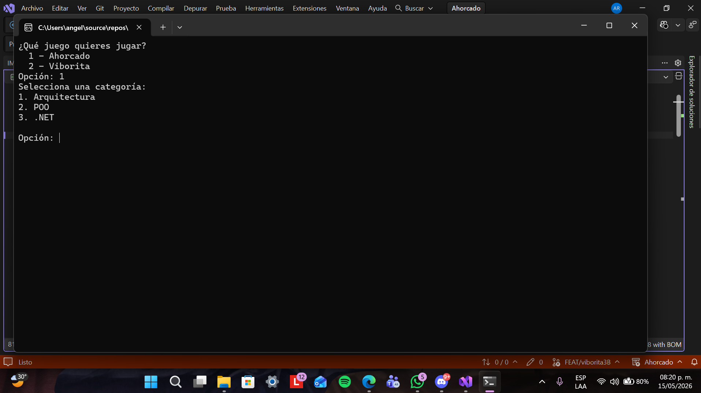

# 🎮 Juego de Ahorcado

## 📌 Datos institucionales

- **Universidad:** Tecnológico de Software
- **Materia:** Arquitectura de Software
- **Proyecto:** Juego de Ahorcado en Consola
- **Alumno:** Ángela Yaritzi Rojas Brito
- **Grupo:** 3B
- **Profesor:** Jorge Javier Pedrozo Romero
- **Fecha:** 15/05/26

---

# 📖 Descripción del proyecto

Este proyecto consiste en el desarrollo de un juego de Ahorcado en consola utilizando C# y .NET. El jugador debe adivinar una palabra secreta ingresando letras desde el teclado antes de quedarse sin intentos.

El proyecto fue refactorizado utilizando separación de responsabilidades para mejorar la organización, mantenimiento y escalabilidad del código.

---

# 🧩 Arquitectura implementada

El proyecto fue dividido en varias clases para separar responsabilidades:

| Clase | Responsabilidad |
|------|----------------|
| `MotorAhorcado` | Lógica principal del juego |
| `ConsolaUI` | Interfaz en consola |
| `PalabrasEnMemoria` | Administración de palabras |
| `IRepositorioPalabras` | Contrato para repositorios |

---

# ▶️ ¿Cómo funciona?

1. El usuario selecciona una categoría.
2. El sistema elige una palabra aleatoria.
3. El jugador ingresa letras.
4. El juego valida si la letra existe.
5. Se descuentan intentos en caso de error.
6. El jugador gana al descubrir toda la palabra.
7. El jugador pierde si se queda sin intentos.

---

# 📷 Capturas de pantalla

## Juego en ejecución

## Ejemplo de victoria o derrota

---

# 🤖 Cláusula de IA

Durante el desarrollo de esta actividad se utilizaron herramientas de inteligencia artificial como apoyo en la estructura del codigo, es decir, al copiar un bloque se le pedia a la IA que lo acomodara o identara de manera correcta.

---

# 🚀 Ejecución del proyecto

1. Clonar el repositorio
2. Abrir el proyecto en Visual Studio
3. Ejecutar el archivo `Program.cs`
4. Seleccionar el juego desde el menú principal

---

# 📂 Contacto

Hecho por: Ángela Yaritzi Rojas Brito
Correo: angela.rojas@tecdesoftware.edu.mx

